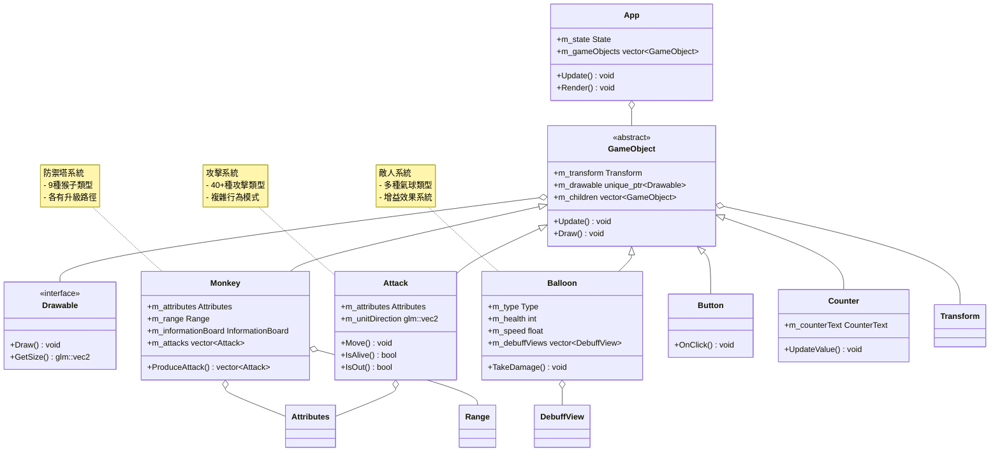
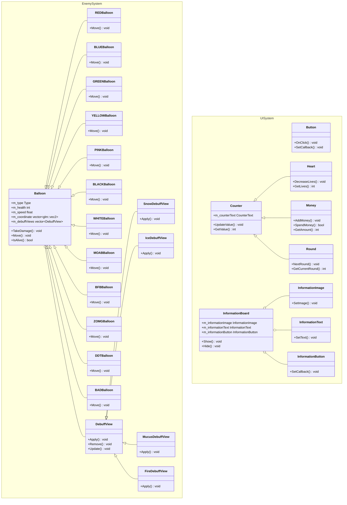

 # PTSD塔防遊戲架構文檔

## 📋 目錄
1. [整體架構圖](#1-整體架構圖)
2. [防禦塔系統詳細圖](#2-防禦塔系統詳細圖)
3. [攻擊系統詳細圖](#3-攻擊系統詳細圖)
4. [敵人和UI系統詳細圖](#4-敵人和ui系統詳細圖)
5. [架構說明](#5-架構說明)

---

## 1. 整體架構圖

此圖展示了系統的主要父類和它們之間的核心關係，提供整個項目的高層次概覽。

**關鍵組件說明：**
- **GameObject**: 所有遊戲物件的基類，提供位置、繪製和子物件管理
- **Monkey**: 防禦塔基類，負責生產攻擊和管理屬性
- **Attack**: 所有攻擊類型的基類，包含移動和碰撞邏輯
- **Balloon**: 敵人基類，管理生命值和增益效果
- **App**: 主要遊戲控制器，管理所有遊戲物件

---

## 2. 防禦塔系統詳細圖

展示完整的防禦塔繼承體系，包含12種不同的猴子類型及其特殊功能。

```mermaid
classDiagram
    %% 防禦塔系統詳細架構
    
    class Monkey {
        +m_attributes Attributes
        +m_range Range
        +m_informationBoard InformationBoard
        +m_attacks vector~Attack~
        +m_level int
        +m_upgradePath int
        +ProduceAttack() vector~Attack~
        +UpdateLevel() void
        +UseSkill() void
    }
    
    class DartMonkey {
        +skillEffect bool
        +ProduceAttack() vector~Attack~
        +UseSkill() void
    }
    
    class NailMonkey {
        +skillEffect bool
        +ProduceAttack() vector~Attack~
    }
    
    class SniperMonkey {
        +ProduceAttack() vector~Attack~
    }
    
    class BoomerangMonkey {
        +has_BladedDisc_Around bool
        +skillEffect bool
        +ProduceAttack() vector~Attack~
    }
    
    class NinjaMonkey {
        +ProduceAttack() vector~Attack~
    }
    
    class Cannon {
        +ProduceAttack() vector~Attack~
    }
    
    class Airport {
        +m_Airplanes vector~Attack~
        +airplane_num int
        +ProduceAttack() vector~Attack~
    }
    
    class BuccaneerMonkey {
        +m_Airplanes vector~Attack~
        +airplane_num int
        +ProduceAttack() vector~Attack~
    }
    
    class SuperMonkey {
        +absorbed_monkeys vector~Monkey~
        +skillEffect bool
        +ProduceAttack() vector~Attack~
    }
    
    class IceMonkey {
        +ProduceAttack() vector~Attack~
    }
    
    class RubberMonkey {
        +ProduceAttack() vector~Attack~
    }
    
    class MagicMonkey {
        +ProduceAttack() vector~Attack~
    }
    
    %% 支援類別
    class Attributes {
        +penetration int
        +power int
        +speed float
        +properties set~string~
        +debuffs vector~Debuff~
    }
    
    class Range {
        +radius float
        +Draw() void
    }
    
    class InformationBoard {
        +m_informationImage InformationImage
        +m_informationText InformationText
        +m_informationButton InformationButton
    }
    
    %% 繼承關係
    Monkey <|-- DartMonkey
    Monkey <|-- NailMonkey
    Monkey <|-- SniperMonkey
    Monkey <|-- BoomerangMonkey
    Monkey <|-- NinjaMonkey
    Monkey <|-- Cannon
    Monkey <|-- Airport
    Monkey <|-- BuccaneerMonkey
    Monkey <|-- SuperMonkey
    Monkey <|-- IceMonkey
    Monkey <|-- RubberMonkey
    Monkey <|-- MagicMonkey
    
    %% 組合關係
    Monkey o-- Attributes
    Monkey o-- Range
    Monkey o-- InformationBoard
    Airport o-- Attack : m_Airplanes
    BuccaneerMonkey o-- Attack : m_Airplanes
    SuperMonkey o-- Monkey : absorbed_monkeys
```

**特殊猴子功能：**
- **Airport & BuccaneerMonkey**: 管理飛機攻擊單位
- **SuperMonkey**: 可以吸收其他猴子獲得能力
- **IceMonkey**: 專門施加冰凍增益效果
- **Cannon**: 發射爆炸性攻擊

---

## 3. 攻擊系統詳細圖

按功能分組展示40+種攻擊類型，每個分組包含具有相似行為模式的攻擊。

```mermaid
classDiagram
    %% 攻擊系統詳細架構
    
    class Attack {
        +m_attributes Attributes
        +m_unitDirection glm::vec2
        +m_radian float
        +m_corners vector~glm::vec2~
        +Move() void
        +IsAlive() bool
        +IsOut() bool
        +SetPosition() void
        +SetRotation() void
    }
    
    %% 基礎投射物
    namespace BasicProjectiles {
        class Dart {
            +Move() void
        }
        
        class Nail {
            +m_radius int
            +m_sourcePosition glm::vec2
            +Move() void
        }
        
        class Superlight {
            +Move() void
        }
        
        class Ray {
            +Move() void
        }
        
        class Rubber {
            +Move() void
        }
    }
    
    %% 迴旋攻擊
    namespace BoomerangAttacks {
        class Boomerang {
            +isTurn int
            +WillNotDisappear bool
            +m_goalPosition glm::vec2
            +Move() void
            +RotationUnitDirection() void
        }
        
        class BladedDisc {
            +isTurn int
            +rotation int
            +Move() void
            +RotationImage() void
        }
        
        class BladedDisc_Rebound {
            +rotation int
            +Move() void
        }
        
        class BladedDisc_Around {
            +renewPenetrationCd int
            +WillNotDisappear bool
            +Move() void
        }
    }
    
    %% 旋轉攻擊
    namespace SpinningAttacks {
        class Shuriken {
            +rotation int
            +Move() void
            +RotationImage() void
        }
        
        class NinjaShuriken {
            +m_currentState State
            +m_randomMovementTime int
            +Move() void
            +CalculateNewDirection() void
        }
        
        class Knife {
            +m_radius int
            +Move() void
        }
    }
    
    %% 爆炸攻擊
    namespace ExplosiveAttacks {
        class Bomb {
            +Move() void
        }
        
        class Explosion {
            +existTime int
            +m_bomb Attack
            +IsAlive() bool
        }
        
        class Explosion_slice {
            +existTime int
            +Move() void
        }
        
        class Explosionlight {
            +existTime int
            +IsAlive() bool
        }
        
        class smallbomb {
            +existTime int
            +Move() void
        }
        
        class Nuclear_bomb {
            +time int
            +Move() void
            +RotationImage() void
        }
    }
    
    %% 區域效果
    namespace AreaEffects {
        class Blizzard {
            +exit int
            +Move() void
            +IsOut() bool
        }
        
        class Fire {
            +exit int
            +m_scale float
            +Move() void
        }
        
        class WindAttack {
            +m_hasReachedGoal bool
            +m_stayDuration int
            +Move() void
        }
    }
    
    %% 特殊攻擊
    namespace SpecialAttacks {
        class Airplane {
            +time int
            +max_Penetration int
            +WillNotDisappear bool
            +Move() void
            +RotationImage() void
        }
        
        class TheBird {
            +time int
            +m_centerPosition glm::vec2
            +m_radius float
            +m_currentAngle float
            +Move() void
            +RotateImage() void
        }
        
        class Rope {
            +m_sourcePosition glm::vec2
            +m_targetPosition glm::vec2
            +time int
        }
        
        class Rope_tail {
            +m_isReturning bool
            +m_isFinished bool
            +CheckAndReverse() bool
        }
    }
    
    %% 繼承關係
    Attack <|-- Dart
    Attack <|-- Nail
    Attack <|-- Superlight
    Attack <|-- Ray
    Attack <|-- Rubber
    
    Attack <|-- Boomerang
    Attack <|-- BladedDisc
    Attack <|-- BladedDisc_Rebound
    Attack <|-- BladedDisc_Around
    
    Attack <|-- Shuriken
    Attack <|-- NinjaShuriken
    Attack <|-- Knife
    
    Attack <|-- Bomb
    Attack <|-- Explosion
    Attack <|-- Explosion_slice
    Attack <|-- Explosionlight
    Attack <|-- smallbomb
    Attack <|-- Nuclear_bomb
    
    Attack <|-- Blizzard
    Attack <|-- Fire
    Attack <|-- WindAttack
    
    Attack <|-- Airplane
    Attack <|-- TheBird
    Attack <|-- Rope
    Attack <|-- Rope_tail
```

**攻擊類型分組說明：**
- **基礎投射物**: 直線移動的簡單攻擊
- **迴旋攻擊**: 具有返回機制的攻擊
- **旋轉攻擊**: 自轉並移動的攻擊
- **爆炸攻擊**: 具有爆炸效果的區域攻擊
- **區域效果**: 持續時間的範圍攻擊
- **特殊攻擊**: 具有獨特行為模式的攻擊

---

## 4. 敵人和UI系統詳細圖

展示敵人類型的完整繼承體系和UI組件架構。

**敵人類型說明：**
- **基礎氣球**: RED, BLUE, GREEN, YELLOW, PINK, BLACK, WHITE
- **高級氣球**: MOAB, BFB, ZOMG, DDT, BAD (具有更高生命值和特殊能力)
- **增益效果**: Snow(減速), Ice(冰凍), Mucus(黏液), Fire(燃燒)

**UI組件說明：**
- **Counter系統**: 管理遊戲中的數值顯示
- **InformationBoard**: 防禦塔資訊顯示面板
- **Button**: 互動式按鈕組件

---

## 5. 架構說明

### 🏗️ **設計模式**
1. **繼承模式**: 使用虛擬函數實現多態行為
2. **組合模式**: GameObject包含Transform和Drawable組件
3. **策略模式**: 不同攻擊類型實現不同的Move()行為
4. **觀察者模式**: UI系統響應遊戲狀態變化

### 🔧 **核心架構特點**
- **模組化設計**: 清楚分離渲染、遊戲邏輯、UI系統
- **可擴展性**: 易於添加新的猴子、攻擊和敵人類型
- **多態性**: 廣泛使用虛擬函數支持動態行為
- **資源管理**: 使用智能指針管理物件生命週期

### 📊 **系統統計**
- **防禦塔類型**: 12種不同的猴子
- **攻擊類型**: 40+種不同的攻擊方式
- **敵人類型**: 12種氣球 + 4種增益效果
- **UI組件**: 完整的遊戲界面系統

### 🎯 **技術亮點**
- **複雜的攻擊系統**: 支持直線、迴旋、爆炸、區域等多種攻擊模式
- **豐富的升級系統**: 每個猴子都有多條升級路徑
- **視覺效果系統**: 完整的增益效果視覺反饋
- **模組化UI**: 可重用的UI組件架構

---

*此文檔基於PTSD塔防遊戲的C++原始碼分析生成，展示了完整的面向對象架構設計。*